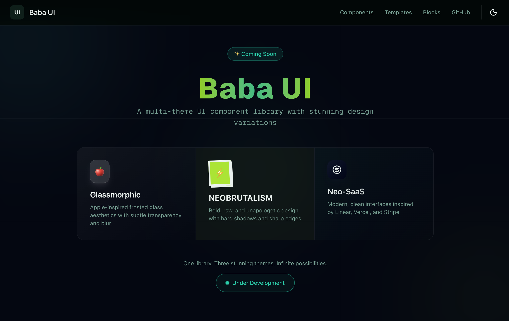

<div align="center">
  
  
  # 🎨 Baba UI

**A multi-theme UI component library with stunning design variations**

[](https://nextjs.org/)
[](https://tailwindcss.com/)
[](https://www.typescriptlang.org/)
[](LICENSE)

[Live Demo](https://ui.babacreates.in) · [Documentation](https://ui.babacreates.in/docs) · [Report Bug](https://github.com/AnmolDotX/ui/issues)

</div>

---

## ✨ What is Baba UI?

Baba UI is a **multi-theme component library** that provides the same components in three distinct visual styles:

| Theme               | Description                                                                         |
| ------------------- | ----------------------------------------------------------------------------------- |
| 🍎 **Glassmorphic** | Apple-inspired frosted glass aesthetics with blur, transparency, and subtle shadows |
| ⚡ **Neobrutalism** | Bold, raw, unapologetic design with hard shadows, thick borders, and high contrast  |
| 🚀 **Neo-SaaS**     | Modern, clean interfaces inspired by Linear, Vercel, and Stripe                     |

Switch between themes seamlessly while maintaining the same component API.

## 🚧 Status

> **Under Active Development** - We're building the foundation and core components.

### Roadmap

- [ ] Core component library (Button, Input, Card, etc.)
- [ ] Three theme variants for each component
- [ ] Theme switcher component
- [ ] Documentation site
- [ ] Figma design kit
- [ ] CLI for component installation

## 🛠️ Tech Stack

- **Framework**: [Next.js 16](https://nextjs.org/) with App Router
- **Styling**: [Tailwind CSS 4](https://tailwindcss.com/)
- **Animations**: [Motion](https://motion.dev/)
- **Components**: [Radix UI](https://radix-ui.com/) primitives
- **Language**: TypeScript
- **Package Manager**: pnpm

## 🚀 Local Setup

### Prerequisites

- Node.js 18+
- pnpm 8+

### Installation

```bash
# Clone the repository
git clone https://github.com/AnmolDotX/ui.git
cd ui

# Install dependencies
pnpm install

# Start development server
pnpm dev
```

Open [http://localhost:3000](http://localhost:3000) in your browser.

### Available Scripts

| Command      | Description              |
| ------------ | ------------------------ |
| `pnpm dev`   | Start development server |
| `pnpm build` | Build for production     |
| `pnpm start` | Start production server  |
| `pnpm lint`  | Run ESLint               |

## 📁 Project Structure

```
src/
├── app/                    # Next.js App Router
│   ├── (root)/            # Main site routes
│   ├── layout.tsx         # Root layout
│   └── globals.css        # Global styles & theme tokens
├── components/
│   ├── layout/            # Layout components (Header, Footer)
│   ├── shadcn/            # Base UI components
│   └── theme/             # Theme provider & toggle
├── constants/             # Navigation & site config
└── lib/                   # Utilities & metadata
```

## 🎨 Theming

Baba UI uses CSS custom properties for theming. All colors are defined in `globals.css` using the OKLCH color space for better color interpolation.

```css
/* Example: Teal/Green/Lime palette */
:root {
  --primary: oklch(0.55 0.18 175); /* Vibrant teal */
  --secondary: oklch(0.92 0.04 155); /* Soft green */
  --accent: oklch(0.85 0.15 130); /* Lime */
}
```

## 🔗 Connect With Us

<div align="center">

[](https://x.com/BabaCreatesUI)
[](https://www.linkedin.com/in/anmoldotx/)
[](https://github.com/AnmolDotX)
[](https://www.instagram.com/babacreates/)

**Portfolio**: [babacreates.in](https://babacreates.in)

</div>

---

<div align="center">
  
  **Built with ❤️ by [Anmol Kumar](https://babacreates.in)**

⭐ Star this repo if you find it helpful!

</div>
